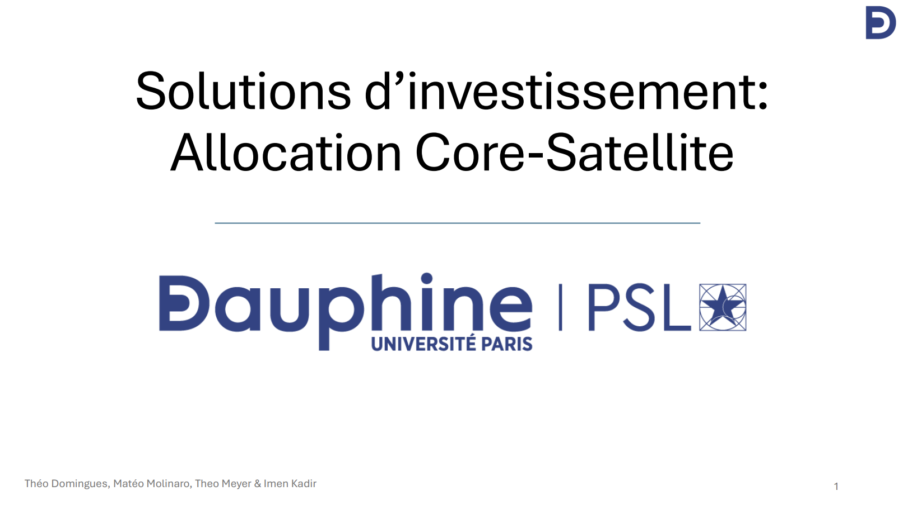
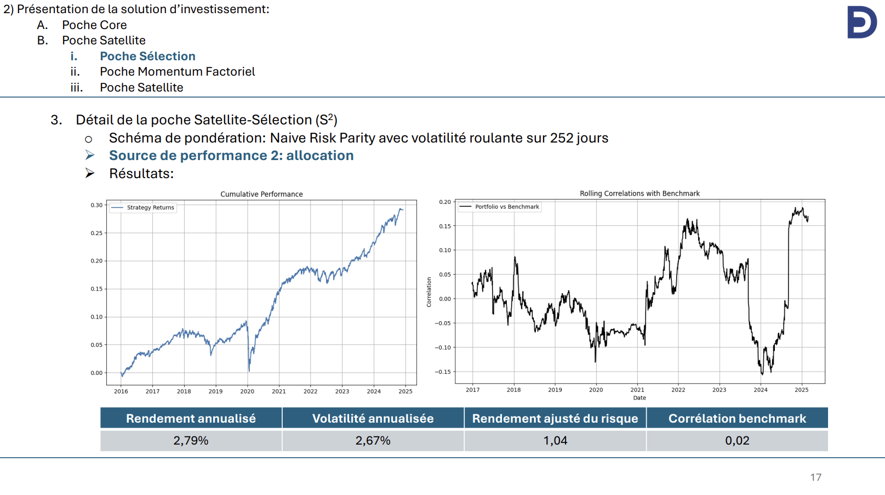

# Inv_Solutions_cross_assets
Solutions d'investissment basée sur une approche Core-Satellite.

Partie Core réalisée par Theo Domingues et Imen Khadir.
Partie Satellite: 1) partie sélection (Matéo Molinaro), 2) partie momentum factoriel (Theo Meyer)

Vous pouvez retrouver nos résultats dans la présentation en pdf ainsi que le code qui a généré ces résultats. J'ai réalisé la stratégie "sélection" de la poche satellite dont les résultats principaux sont les suivants:

